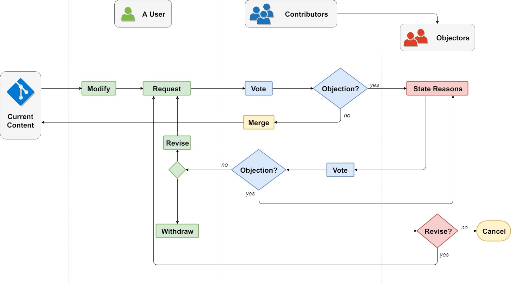

# 讨论流程

讨论的流程和讨论的内容的形式是解耦的。

# 内容的形式

内容的形式设想为网络形状。

---

# 全票通过

自由在没有让步的情况下，对民主能开出的最大优惠。

# 草案

存放零碎想法，直至思考或讨论成形。类似于Git中的缓存区或stage。

# 请求定义

定义是所有严肃讨论的前提。

# 引出子话题

# 链接节点

# 必须给出理由

这是为了防止有人捣乱。

# 有效陈述的形式？

# 公民训练